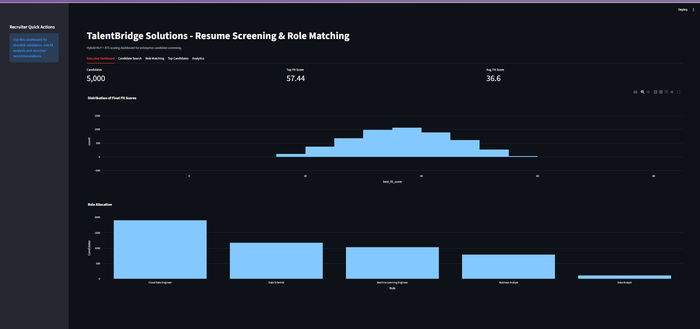
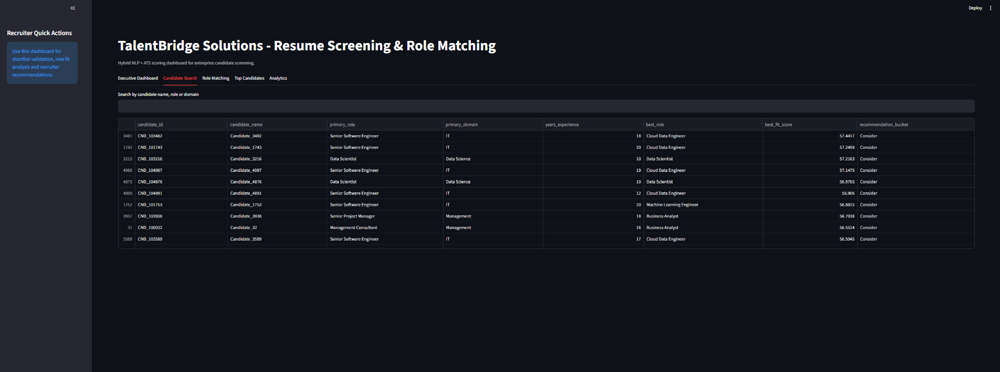
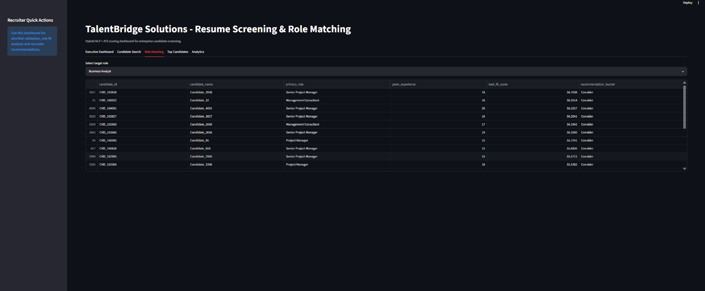
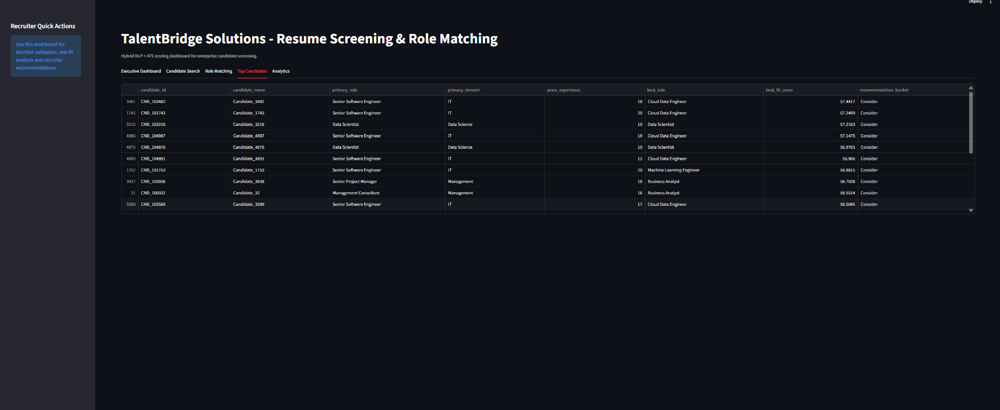
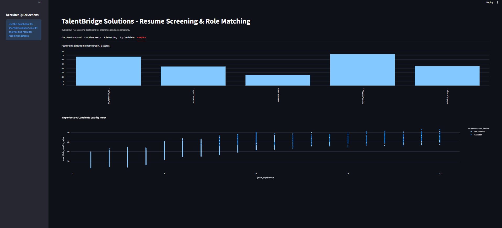

# Resume Screening & ATS Role Matching using NLP

> An end-to-end Data Science and NLP solution for automated resume screening, candidate-role matching, ATS scoring, and recruiter analytics.

**Author:** Sahil Uniyal
**Project Type:** Data Science / NLP Capstone
**Application:** Streamlit

---

## 📌 Project Overview

Recruiters often receive thousands of resumes for a single hiring cycle, making manual screening time-consuming and inconsistent.

This project develops an enterprise-style **Resume Screening and Role Matching System** that combines **Natural Language Processing (NLP), feature engineering, TF-IDF, cosine similarity, and a hybrid ATS scoring engine** to evaluate candidates and identify the best-fit profiles for different job roles.

The system processes **5,000 candidate profiles with 34 structured resume attributes**, engineers **15+ business-driven features**, evaluates candidates across **5 enterprise roles**, and generates recruiter-friendly recommendations through an interactive Streamlit dashboard.

---

## 🎯 Business Problem

Traditional resume screening can suffer from:

* High manual screening effort
* Keyword-only matching
* Inconsistent candidate evaluation
* Difficulty comparing candidates across different roles
* Longer hiring cycles

The goal of this project is to provide recruiters with an **explainable, data-driven decision-support system** for faster and more consistent candidate screening.

---

## 🚀 Key Features

* Automated resume data validation and preprocessing
* Feature engineering for candidate evaluation
* NLP-based resume-to-role matching
* TF-IDF vectorization
* Cosine similarity scoring
* Hybrid ATS Fit Score
* Candidate ranking
* Role-specific candidate recommendations
* Recruiter-friendly recommendation categories
* Interactive Streamlit dashboard
* Recruitment analytics and visualizations
* Automated validation and ranking reports

---

## 📊 Project Scale

| Metric                    |                      Value |
| ------------------------- | -------------------------: |
| Candidate Profiles        |                      5,000 |
| Resume Attributes         |                         34 |
| Engineered Features       |                        15+ |
| Enterprise Roles          |                          5 |
| Recommendation Categories |                          4 |
| Dashboard                 |                  Streamlit |
| NLP Technique             | TF-IDF + Cosine Similarity |

---

## 💼 Enterprise Roles

The system evaluates candidates against five manually defined enterprise roles:

1. Data Scientist
2. Data Analyst
3. Machine Learning Engineer
4. Business Analyst
5. Cloud Data Engineer

Each role contains relevant skills, experience expectations, certifications, domain preferences, and leadership requirements.

---

## 🧠 NLP & ATS Methodology

The project uses a hybrid approach instead of relying only on keyword matching.

### NLP Pipeline

```text
Resume Data
    ↓
Text Cleaning
    ↓
Text Normalization
    ↓
TF-IDF Vectorization
    ↓
Cosine Similarity
    ↓
Resume-to-Role Similarity
```

### Hybrid ATS Scoring

The final candidate evaluation combines multiple business factors:

* Technical Skill Match
* Experience Match
* Project Relevance
* Education Strength
* ATS Readiness
* Leadership Capability

This produces an explainable **ATS Fit Score** used for candidate ranking and recommendation.

---

## ⚙️ Feature Engineering

The system creates business-oriented features including:

* Resume Quality Score
* ATS Readiness Score
* Technical Strength Score
* Leadership Score
* Domain Alignment Score
* Project Relevance Score
* Certification Strength Score
* Experience Bucket
* Skill Density Score
* Role Readiness Score
* Career Progression Score
* Education Strength Score
* Professional Maturity Score
* Candidate Quality Index

These features transform raw resume information into measurable indicators for recruitment analytics.

---

## 🖥️ Streamlit Dashboard

The application provides an interactive recruiter dashboard with:
## 📸 Application Screenshots

### 1. Executive Dashboard

The executive dashboard provides an overview of the candidate pool, ATS performance, role distribution, and key recruitment metrics.



### 2. Candidate Search

The candidate search interface allows recruiters to search and explore candidate profiles based on relevant attributes.



### 3. Role Matching

The role matching module ranks candidates according to their suitability for a selected enterprise role.



### 4. Top Candidates

The top candidates section highlights the highest-ranked candidates based on the system's ATS scoring and role-fit evaluation.



### 5. Recruitment Analytics

The analytics section provides visual insights into candidate quality, ATS scores, role alignment, and recruitment trends.



### Executive Dashboard

* Total candidates
* Average ATS score
* Highest-fit candidates
* ATS score distribution
* Role allocation

### Candidate Search

Search and explore candidates using:

* Candidate name
* Primary role
* Domain

### Role Matching

Select a target enterprise role and view the highest-ranked candidates.

### Top Candidates

View the strongest candidates across the evaluated roles.

### Analytics

Explore candidate quality, ATS metrics, feature importance, and recruitment trends.

---

## 📁 Project Structure

```text
resume-screening-ats-capstone/
│
├── src/
│   ├── ats_pipeline.py
│   └── role_catalog.py
│
├── outputs/
│   ├── ranked_candidates.csv
│   ├── role_definitions.json
│   └── validation_report.csv
│
├── app.py
├── parsed_resumes.csv
├── resume_screening_capstone.ipynb
├── Data Definition (3).xlsx
├── business_report.md
├── Resume-Screening-and-Role-Matching-using-NLP.pdf
├── requirements.txt
├── .gitignore
└── README.md
```

---

## 🛠️ Technology Stack

* **Python**
* **Pandas**
* **NumPy**
* **Scikit-learn**
* **NLTK**
* **TF-IDF**
* **Cosine Similarity**
* **Streamlit**
* **Plotly**
* **Matplotlib**
* **JSON**
* **Feature Engineering**
* **HR / Recruitment Analytics**

---

## ▶️ How to Run Locally

### 1. Clone the repository

```bash
git clone https://github.com/Sahiluniyal/resume-screening-ats-capstone.git
```

### 2. Navigate into the project

```bash
cd resume-screening-ats-capstone
```

### 3. Install dependencies

```bash
pip install -r requirements.txt
```

### 4. Run the Streamlit application

```bash
streamlit run app.py
```

The application will open locally in your browser.

---

## 📈 Project Outputs

The system generates:

* Ranked candidate results
* Validation reports
* Enterprise role definitions
* Recruitment analytics
* Business analysis documentation
* Interactive dashboard outputs

---

## 🔮 Future Improvements

Possible extensions include:

* Resume PDF parsing
* Transformer-based embeddings
* Sentence Transformers
* BERT-based semantic matching
* Real enterprise job descriptions
* Recruiter feedback learning
* Explainable AI techniques
* Cloud-based deployment
* Production ATS integration

---

## 📄 Project Documentation

Detailed project documentation is available in:

* `business_report.md`
* `Resume-Screening-and-Role-Matching-using-NLP.pdf`
* `resume_screening_capstone.ipynb`

---

## 👨‍💻 Author

**Sahil Uniyal**

B.Tech — Computer Science & Engineering

Data Science | Machine Learning | NLP | Data Analytics

---

## ⭐ Project

If you find this project useful, feel free to explore the repository and review the implementation.
